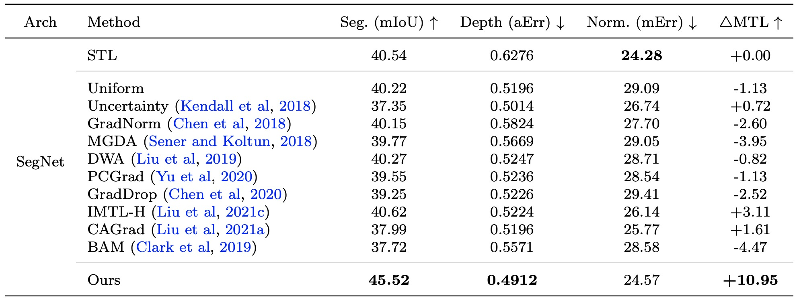

# Universal Representations
We propose a <b>Universal Representation Learning</b> framework in (a) that generalizes over multi-task dense prediction tasks (b), multi-domain many-shot learning (c), cross-domain few-shot learning (d) by distilling knowledge of multiple task/domain-specific networks into a single deep neural network after aligning its representations with the task/domain-specific ones through small capacity adapters.

<p align="center">
  
  Figure 1. <b>Universal Representation Learning.</b>
</p>

> [**Universal Representations: A Unified Look at Multiple Task and Domain Learning**](https://arxiv.org/abs/2204.02744),            
> Wei-Hong Li, Xialei Liu, Hakan Bilen,        
> *Preprint 2022 ([arXiv 2204.02744](https://arxiv.org/abs/2204.02744))* 
>
> [**Universal Representation Learning from Multiple Domains for Few-shot Classification**](https://arxiv.org/abs/2103.13841),            
> Wei-Hong Li, Xialei Liu, Hakan Bilen,        
> *ICCV 2021 ([arXiv 2103.13841](https://arxiv.org/abs/2103.13841))*  
>
> [**Knowledge distillation for multi-task learning**](https://arxiv.org/abs/2007.06889),            
> Wei-Hong Li, Hakan Bilen,        
> *ECCV Workshop 2020 ([arXiv 2007.06889](https://arxiv.org/abs/2007.06889))*  

## Updates
* July'22, Code for [Universal Representations: A Unified Look at Multiple Task and Domain Learning](https://arxiv.org/abs/2204.02744) is now available!
* April'22, The preprint of our paper is now available! Code will be available soon! One can refer to [URL](https://github.com/VICO-UoE/URL) for the implementation on Cross-domain Few-shot Learning.

## Features at a glance
- We propose a unified look at jointly learning multiple vision tasks and visual domains through universal representations, a single deep neural network.

- We propose distilling knowledge of multiple task/domain-specific networks into a single deep neural network after aligning its representations with the task/domain-specific ones through small capacity adapters.

- We rigorously show that universal representations achieve state-of-the-art performances in learning of multiple dense prediction problems in NYU-v2 and Cityscapes, multiple image classification problems from diverse domains in Visual Decathlon Dataset and cross-domain few-shot learning in MetaDataset.

## Main Results

### Multi-task Learning on NYU-v2 with SegNet

<p align="center">
  
  Table 1. <b>Testing Results on NYU-v2.</b>
</p>

### Multi-domain Learning on Visual Decathlon with ResNet-26

<p align="center">
  
  Table 2. <b>Testing Results on Visual Decathlon.</b>
</p>

### Cross-domain Few-shot Learning on Meta-Dataset with ResNet-18

<p align="center">
  
  Table 3. <b>Testing Results on Meta-Dataset.</b>
</p>

## Usage

### [Multi-task Learning](./DensePred/) on NYU-v2
We evaluate our method on NYU-v2 dataset for learning universal representations to jointly perform multiple dense prediction tasks (Semantic Segmentation, Depth Estimation and Surface Normal Estimation) within a single network and compare our method with existing multi-task optimization methods.

### [Multi-domain Learning](./VisualDecathlon/) on Visual Decathlon
We evaluate our method on Visual Decathlon dataset for learning universal representations over diverse visual domains (i.e. 10 datasets such as ImageNet, UCF101) within a single network and compare our method with multi-domain learning methods.

### [Cross-domain Few-shot Learning](https://github.com/VICO-UoE/URL) on Meta-dataset
We evaluate our method on MetaDataset for learning universal representations from multiple diverse visual domains (i.e. 8 datasets such as ImageNet, Birds, Quick Draw) within a single network for Cross-domain Few-shot Learning and compare our method with existing state-of-the-art methods.

## Model Zoo

### Multi-task Learning on NYU-v2 with SegNet
[STL Models](https://drive.google.com/drive/folders/1EAYEjsUmc65x24P7kVwjZ51w_5AQCBZf) | [URL Model](https://drive.google.com/drive/folders/1jO85idM4EwyRL8BpNpGonTqpiYHxf53L)

### Multi-domain Learning on Visual Decathlon with ResNet-26
[SDL Models](https://drive.google.com/drive/folders/1m4A6bUPd_s9F1qZXzd-VQ1rkciyXpsyf) | [SDL Models (Train+Val)](https://drive.google.com/drive/folders/1SIVX_Akli6TIdHWhZzStCu2aKDaudrOI) | [URL Model (Train+Val)](https://drive.google.com/drive/folders/19DTgubH9CjogQrSWCMnjrXPnUZcD2Set) | [URL (Parallel Adapter) Model (Train+Val)](https://drive.google.com/drive/folders/1891Zg45dzLPaOLL23YmBSzQdLt4RL9XK)

### Cross-domain Few-shot Learning on Meta-Dataset with ResNet-18
[SDL Models](https://drive.google.com/file/d/1MvUcvQ8OQtoOk1MIiJmK6_G8p4h8cbY9) | [URL Model](https://drive.google.com/file/d/1Dv8TX6iQ-BE2NMpfd0sQmH2q4mShmo1A/view?usp=sharing)

## Contact
For any question, you can contact [Wei-Hong Li](https://weihonglee.github.io).

## Citation
If you use this code, please cite our papers:
```
@article{li2022Universal,
    author    = {Li, Wei-Hong and Liu, Xialei and Bilen, Hakan},
    title     = {Universal Representations: A Unified Look at Multiple Task and Domain Learning},
    journal   = {arXiv preprint arXiv:2204.02744},
    year      = {2022}
}

@inproceedings{li2021Universal,
    author    = {Li, Wei-Hong and Liu, Xialei and Bilen, Hakan},
    title     = {Universal Representation Learning From Multiple Domains for Few-Shot Classification},
    booktitle = {IEEE/CVF International Conference on Computer Vision (ICCV)},
    month     = {October},
    year      = {2021},
    pages     = {9526-9535}
}

@inproceedings{li2020knowledge,
    author    = {Li, Wei-Hong and Bilen, Hakan},
    title     = {Knowledge distillation for multi-task learning},
    booktitle = {European Conference on Computer Vision (ECCV) Workshop},
    year      = {2020},
    xcode     = {https://github.com/VICO-UoE/KD4MTL}
}
```